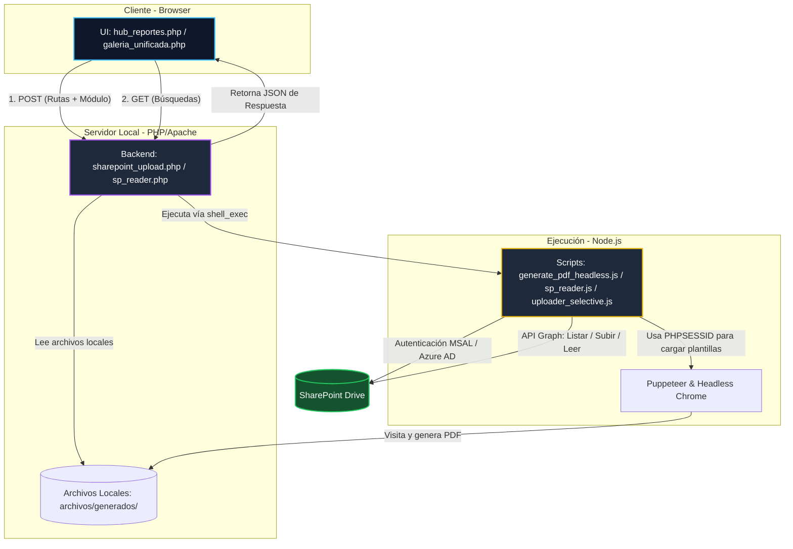
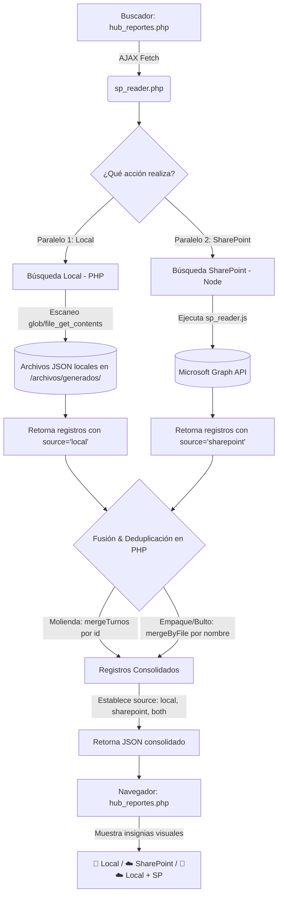

# Central Documental - Contexto de Arquitectura y Código

Este documento provee un análisis detallado y exhaustivo del módulo **Central Documental** (también conocido como **HUB Maestría Documental**) del sistema **FMT**. Su propósito es servir como la guía de referencia definitiva y contexto completo para Claude y otros modelos de lenguaje que requieran mantener, depurar o expandir este código.

---

## 1. Arquitectura General y Propósito del Módulo

El módulo **Central Documental** tiene como objetivo la visualización, conversión, almacenamiento, búsqueda unificada y migración de reportes diarios generados por el sistema hacia **Microsoft SharePoint** utilizando **Microsoft Graph API**. 

Actúa como una pasarela híbrida (PHP + Node.js) que:
1. **Interfaz (Frontend - PHP/HTML/JS)**: Permite a los usuarios visualizar los archivos locales organizados por módulos, seleccionar múltiples reportes y enviarlos a SharePoint, además de realizar búsquedas híbridas (por fecha o lote) que barren tanto las carpetas locales del servidor como SharePoint en paralelo.
2. **Preprocesamiento y Generación (Backend - PHP)**: Administra la lógica de sesión, coordina la conversión de plantillas web y archivos Excel a formato PDF y genera archivos JSON atómicos temporales para sincronizaciones bilaterales.
3. **Ejecución y Conectividad (Node.js)**: Utiliza Puppeteer para el renderizado fiel de vistas HTML a PDF, y el SDK de Microsoft Graph para listar, leer y subir archivos grandes de forma segmentada (chunked upload) a SharePoint.

### Mapa de Interacciones



---

## 2. Matriz de Archivos del Módulo

El módulo consta de **6 archivos principales** ubicados en la carpeta `template/central_documental/`, coordinados con el script de subida selectiva en la carpeta superior:

| Archivo | Tipo / Lenguaje | Tamaño | Rol Principal | Dependencias Clave |
| :--- | :--- | :--- | :--- | :--- |
| [hub_reportes.php](file:///var/www/fmt/template/central_documental/hub_reportes.php) | Frontend / PHP | ~36 KB | Tablero principal del módulo. Agrupa los formatos y expone el motor de Búsqueda Unificada (por Fecha y Lote de producto). | `../sesion.php` (Auth), CSS Integrado (Cyberpunk), JS Fetch API |
| [galeria_unificada.php](file:///var/www/fmt/template/central_documental/galeria_unificada.php) | Frontend / PHP | ~25 KB | Galería visual que lista archivos locales de un módulo específico. Permite la selección múltiple y lanza el modal de subida a SharePoint. | `../sesion.php`, `sharepoint_upload.php` (AJAX Endpoint), CSS Cyberpunk |
| [sharepoint_upload.php](file:///var/www/fmt/template/central_documental/sharepoint_upload.php) | API / PHP | ~11 KB | Controlador de subida. Resuelve rutas locales, intercepta formatos para convertirlos a PDF (vía Puppeteer o cURL), genera JSONs atómicos y arranca el uploader Node.js. | `../sesion.php`, `generate_pdf_headless.js`, `../descargar_pdf.php` (Excel PDFs), `../uploader_selective.js` |
| [generate_pdf_headless.js](file:///var/www/fmt/template/central_documental/generate_pdf_headless.js) | CLI / Node.js | ~4.3 KB | Script Puppeteer que levanta un Chrome headless, inyecta la cookie de sesión PHP de la petición activa, visita la plantilla HTML correspondiente y genera un PDF A4 exacto. | `puppeteer` npm, Chrome Local (`/var/www/fmt/chrome-linux64/chrome`), `fs` |
| [sp_reader.php](file:///var/www/fmt/template/central_documental/sp_reader.php) | API / PHP | ~27 KB | Endpoint de búsqueda híbrida. Realiza búsquedas locales leyendo archivos `.json` del servidor, y en paralelo ejecuta `sp_reader.js` para consultar SharePoint, fusionando y deduplicando ambos resultados. | `../sesion.php`, `sp_reader.js` |
| [sp_reader.js](file:///var/www/fmt/template/central_documental/sp_reader.js) | CLI / Node.js | ~3.7 KB | Cliente Microsoft Graph API para consultas de lectura en SharePoint. Lista carpetas y lee archivos JSON directamente en la nube. | `@microsoft/microsoft-graph-client`, `@azure/identity` (ClientSecretCredential), `dotenv` |
| [uploader_selective.js](file:///var/www/fmt/template/uploader_selective.js) *(Carpeta padre)* | CLI / Node.js | ~8.1 KB | Cliente Microsoft Graph API encargado de realizar la carga física a SharePoint. Soporta carga directa y subida por fragmentos (chunked upload) para archivos >4MB. | `@microsoft/microsoft-graph-client`, `@azure/identity`, `dotenv`, `fs`, `path` |

---

## 3. Configuración y Variables de Entorno (.env)

Los scripts Node.js (`sp_reader.js` y `uploader_selective.js`) leen el archivo `.env` ubicado en `/var/www/fmt/template/.env` (o en la raíz del proyecto). Las credenciales de Azure AD (Microsoft Entra ID) requeridas son:

| Variable | Tipo | Descripción | Uso en el Código |
| :--- | :--- | :--- | :--- |
| `TENANT_ID` | UUID | Identificador del inquilino de Azure Active Directory. | Conexión con `ClientSecretCredential`. |
| `CLIENT_ID` | UUID | ID de la aplicación registrada en Azure AD (Application ID). | Conexión con `ClientSecretCredential`. |
| `CLIENT_SECRET` | String | Llave/Secreto de la aplicación registrada para autenticación no interactiva. | Conexión con `ClientSecretCredential`. |
| `SHAREPOINT_DRIVE_ID` | String | Identificador del drive (biblioteca de documentos) en SharePoint. | Especifica el contenedor del sitio (`/drives/{driveId}`). |
| `SHAREPOINT_UPLOAD_PATH` | String | Directorio base de almacenamiento en SharePoint para archivos generales y JSON. | Ruta destino en SharePoint (ej: `Documentos compartidos/Documentos Generados OMAS`). |
| `SHAREPOINT_PDF_PATH` | String | *(Opcional)* Directorio base en SharePoint exclusivamente para PDFs públicos. | Si no está definido, se usa `SHAREPOINT_UPLOAD_PATH` por defecto. |

---

## 4. Análisis Detallado de Flujos de Lógica

### A. Flujo de Subida y Conversión (Upload & Rendering Flow)
Cuando el usuario selecciona archivos en [galeria_unificada.php](file:///var/www/fmt/template/central_documental/galeria_unificada.php) y presiona **"Subir a SharePoint"**, ocurre el siguiente proceso secuencial:

```mermaid
sequenceDiagram
    autonumber
    actor Usuario
    participant Galeria as galeria_unificada.php (Browser)
    participant UploadPHP as sharepoint_upload.php (PHP)
    participant HeadlessJS as generate_pdf_headless.js (Node)
    participant Chrome as Headless Chrome
    participant UploaderJS as uploader_selective.js (Node)
    participant GraphAPI as MS Graph API (SharePoint)

    Usuario->>Galeria: Selecciona archivos y pulsa Subir
    Galeria->>UploadPHP: POST { archivos: [...], modulo: 'molienda_v2' }
    Note over UploadPHP: Inicia procesamiento por archivo
    
    rect rgb(30, 30, 45)
        Note over UploadPHP: Formato HTML (ej. Molienda, Empaque)
        UploadPHP->>UploadPHP: session_write_close() [Previene deadlock]
        UploadPHP->>HeadlessJS: ejecuta por shell_exec
        HeadlessJS->>Chrome: Lanza Puppeteer con PHPSESSID
        Chrome->>Chrome: Carga visor web de plantilla y exporta a PDF
        Chrome-->>UploadPHP: Retorna archivo PDF temporal en disco
        
        Note over UploadPHP: Molienda bilateral (Genera JSON atómico diario)
        UploadPHP->>UploadPHP: Filtra turnos de la fecha desde el mensual y crea Molienda_ZC_YYYY-MM-DD.json
    end

    rect rgb(30, 45, 30)
        Note over UploadPHP: Formato Excel (ej. Liberaciones)
        UploadPHP->>UploadPHP: Realiza cURL a descargar_pdf.php con PHPSESSID
        UploadPHP-->>UploadPHP: Guarda datos binarios como PDF temporal en disco
    end

    UploadPHP->>UploaderJS: Ejecuta shell_exec(node uploader_selective.js [Lista de archivos])
    
    loop Para cada archivo
        UploaderJS->>UploaderJS: Extrae YYYY-MM del nombre del archivo
        alt Tamaño > 4 MB
            UploaderJS->>GraphAPI: Solicita UploadSession
            UploaderJS->>GraphAPI: Envía bloques (chunks) de 3.25 MB
        else Tamaño <= 4 MB
            UploaderJS->>GraphAPI: Carga directa vía PUT
        end
        GraphAPI-->>UploaderJS: 201 Created / 200 OK
    end

    UploaderJS-->>UploadPHP: Retorna JSON de resultados { success: true, uploaded: [...] }
    UploadPHP->>UploadPHP: Elimina archivos PDF y JSON atómicos temporales creados en disco
    UploadPHP-->>Galeria: Retorna JSON de resultados de la migración
    Galeria-->>Usuario: Muestra log y marca tarjetas con ☁️ SUBIDO
```



#### Aspectos Críticos del Flujo de Subida:
* **Deadlock de Sesión PHP (`session_write_close()`)**: En `sharepoint_upload.php` ([Línea 131](file:///var/www/fmt/template/central_documental/sharepoint_upload.php#L131)), antes de que PHP invoque a Puppeteer (`generate_pdf_headless.js`), es obligatorio cerrar la sesión de PHP de forma explícita. PHP bloquea el archivo de sesión por defecto para evitar concurrencias de escritura; si no se cierra, la instancia de Chrome en Puppeteer no podrá leer la sesión al solicitar la plantilla, generando un timeout infinito o redirigiendo al login.
* **Flujos Bilaterales**:
  * **Molienda V2**: Cuando se sube la molienda de un día, no se sube el archivo mensual completo directamente. El backend lee el archivo mensual local, filtra los registros del día específico, escribe un archivo JSON temporal (`Molienda_{sede}_{fecha}.json`) y sube **tanto el PDF visual como el JSON del día**.
  * **Empaque V2**: Sube en paralelo el archivo `.json` de datos del lote del empaque y su correspondiente representación visual en `.pdf`.

---

### B. Flujo de Búsqueda Unificada (Unified Search & Reader Flow)
El buscador unificado en [hub_reportes.php](file:///var/www/fmt/template/central_documental/hub_reportes.php) realiza peticiones AJAX asíncronas en paralelo para Molienda, Empaque y Cantidad en Bulto a `sp_reader.php` utilizando los siguientes métodos:



---

## 5. Mappings y Lógica de Rutas

### Mapeo de Directorios (Local a SharePoint)
En el script Node.js [uploader_selective.js](file:///var/www/fmt/template/uploader_selective.js#L47-L86), existe un mapeo estricto (`folderMap`) para traducir las carpetas técnicas locales del servidor Apache a carpetas legibles dentro de la estructura corporativa de SharePoint:

```javascript
const folderMap = {
    'control_cantidad':      'Control de Cantidad Producto en Bulto',
    'control_cantidad_zs':   'Control de Cantidad ZS',
    'control_familiar':      'Control Familiar',
    'empaque_v2':            'Control de Empaque V2',
    'envasado':              'Linea de Envasado',
    'envasadozs':            'Linea de Envasado ZS',
    'excelC_M':              'Control de Molienda',
    'excelC_MZS':            'Control de Molienda ZS',
    'excelS_M':              'Solicitudes de Mantenimiento',
    'excelS_MZS':            'Solicitudes de Mantenimiento ZS',
    'premezclas':            'Premezclas y Harinas Especiales',
    'Purga De proceso':      'Purga del Proceso',
    'reprocesos_zc':         'Control de Reprocesos ZC',
    'molienda':              'Molienda V2',
    'liberaciones_mant':     'Liberaciones Mantenimiento',
    'Calidad':               'Calidad',
    'HSEQ':                  'HSEQ',
    'PNC':                   'PNC',
    'termohigrometros':      'Termohigrometros',
    'gestion_subproductos':  'Gestion de Subproductos',
    'tara_seca':             'Tara Seca',
};
```

### Determinación Dinámica del Mes Destino
En SharePoint, los archivos se organizan por año-mes en formato `YYYY-MM` (ej. `2026-05`). El script de subida analiza dinámicamente el nombre del archivo para extraer la fecha antes de decidir en qué carpeta ubicarlo:
* **Regla**: Aplica una expresión regular `filename.match(/(\d{4}-\d{2})-\d{2}/)` para detectar fechas tipo `YYYY-MM-DD` en el nombre (como `Molienda_ZC_2026-05-12.pdf`).
* **Fallback**: Si no existe coincidencia, utiliza el mes en el que se ejecuta la migración (`defaultMonthFolder`).

---

## 6. Detalles Clave de Implementación y Algoritmos Especiales

### A. Puppeteer Headless PDF (`generate_pdf_headless.js`)
* **Ubicación del binario**: Usa un binario local específico ubicado en `/var/www/fmt/chrome-linux64/chrome` ([Línea 19](file:///var/www/fmt/template/central_documental/generate_pdf_headless.js#L19)).
* **Optimización de red**: Activa `page.setRequestInterception(true)` ([Línea 38](file:///var/www/fmt/template/central_documental/generate_pdf_headless.js#L38)) y aborta requests dirigidos a trackers externos (Google Analytics, Facebook, Doubleclick) para prevenir bloqueos de navegación y timeout por falta de internet.
* **Tolerancia a errores de carga**: Si el comando `page.goto` falla por timeout pero el DOM cargado contiene HTML (`bodyContent >= 100` caracteres), prosigue a renderizar el PDF en vez de abortar el proceso.

### B. Subida de Archivos Grandes (Chunked Upload)
En `uploader_selective.js` ([Línea 107](file:///var/www/fmt/template/uploader_selective.js#L107)), si el archivo es mayor a 4MB, no se puede utilizar una simple petición PUT. El script implementa el flujo de fragmentación de Microsoft Graph:
1. Crea una sesión de subida enviando un `POST` al endpoint `/createUploadSession`.
2. Lee el archivo local a memoria en un buffer.
3. Divide el buffer en bloques de **3.25 MB** (`3.25 * 1024 * 1024` bytes).
4. Sube cada fragmento secuencialmente enviando peticiones `PUT` a la URL provista por la sesión, indicando la cabecera de rango `Content-Range: bytes START-END/TOTAL_SIZE`.

### C. Estilos de la Interfaz (Tema Cyberpunk)
Tanto `hub_reportes.php` como `galeria_unificada.php` aplican un tema oscuro futurista ("Cyberpunk") con:
* Paleta HSL en negros profundos (`#050608`), superficies oscuras (`#0f111a`), bordes fríos (`#1e243a`), y acentos neon de alto contraste (Cian `#00f2ff` para molienda, Naranja `#f59e0b` para empaque, y Azul Microsoft `#0078d4` para SharePoint).
* Animaciones fluidas en `hover` de tarjetas (escalado a `1.03` y sombras difuminadas).
* Modales con desenfoque de fondo en tiempo real (`backdrop-filter: blur(8px)`).

### D. Arquitectura de Búsqueda Híbrida (Local + SharePoint)
El módulo implementa un modelo de almacenamiento híbrido. Aunque el histórico a largo plazo reside y se consulta en la nube (SharePoint), la búsqueda unificada realiza barridos en el servidor local para garantizar el acceso inmediato a archivos recién generados que aún no se han sincronizado.
* **Fusión de Fuentes:** El backend en `sp_reader.php` lee los archivos locales del repositorio en `/var/www/fmt/archivos/generados/` e interroga al mismo tiempo a SharePoint vía `sp_reader.js`.
* **Identificación del Sincronismo:** Al mezclar los resultados, se marca cada registro con un origen (`local` si solo está en el servidor, `sharepoint` si solo está en la nube, o `both` si existe en ambos). Esto permite que el frontend pinte insignias visuales informativas.
* **Ventanas de Búsqueda (Lookback Windows):** Para las búsquedas en SharePoint (donde recorrer todo el histórico degradaría el rendimiento), se mantienen ventanas estrictas de consulta:
  * Empaque/Bulto por fecha: Busca en el mes de la fecha indicada + los **3 meses anteriores** + el mes actual.
  * Búsqueda por Lote de Producto: Escanea y descarga los archivos de los **últimos 6 meses** iterativamente.

---

## 7. Logs y Solución de Problemas

El módulo genera dos archivos de logs en el servidor local para rastrear fallos de conectividad o conversión:
1. **`sp_debug.log`** (`/var/www/fmt/sp_debug.log`):
   * Contiene logs detallados del backend PHP en `sharepoint_upload.php`.
   * Registra las URLs generadas para Puppeteer, comandos shell ejecutados, el Session ID copiado, y la salida stdout/stderr cruda del script de Node.js.
2. **`uploader.log`** (`/var/www/fmt/archivos/generados/LOGS/uploader.log`):
   * Contiene logs de la ejecución de `uploader_selective.js`.
   * Registra cada archivo subido con su peso en bytes, la ruta final en SharePoint y los errores detallados devueltos por la API de Microsoft Graph.
