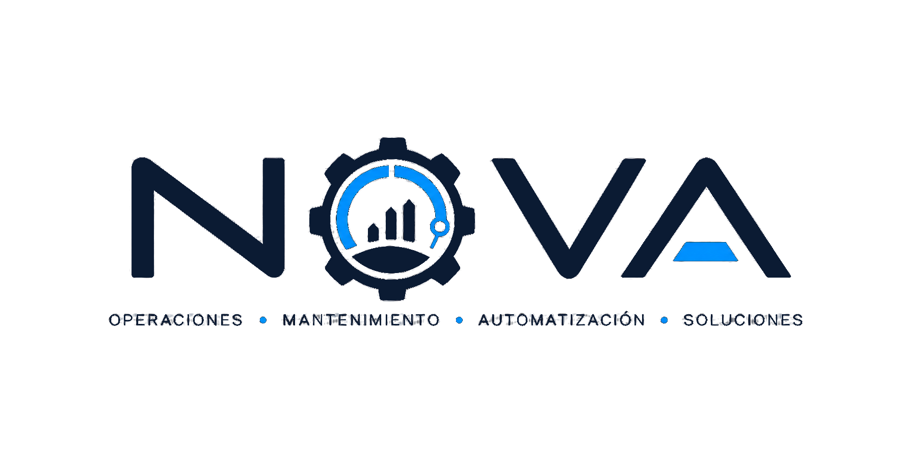

# Cómo crear un nuevo menú "Hub Radial"

Este es el estándar de estilo para páginas de **menú** (no confundir con
`.agent/workflows/crear-formato.md`, que es para formularios). Referencia
viva — los ejemplos reales de este patrón:

- `template/menu_adm.html` — hub de 6 nodos (`--hex-N`), tema claro, menú
  de nivel superior (el engranaje central navega a
  `menu_administracion.html`). Pasó de 5 nodos (`--pos-1..5`) a hexágono al
  agregarse el nodo "Usuario" (`--hex-1`, 12 en punto). Ese nodo también
  lleva `hub-node--pulse`: emite ondas si hay notificaciones sin leer en la
  bandeja, para guiar al usuario hacia `menu_usuario.html` → bandeja.
  **Botones filtrados por área operativa:** cada `hub-node-anchor` lleva
  `data-nodo="..."` y `.hub` nace con `data-filtro="pendiente"` (nodos y
  spokes ocultos). `filtrarMenu()` consulta
  `admin/menu_operaciones_visibles.php`, quita los botones que la sesión no
  puede ver y reasigna los cupos a una figura simétrica según cuántos
  quedan (1-3 y 5-6 → `--hex-N`, 4 → `--quad-N`), reconstruyendo
  spokes/markers. Qué área ve qué botón se configura en
  `admin/menu_admin.php` → "Visibilidad del Menú de Operaciones"; los `adm`
  ven todo.
- `template/menu_usuario.html` — hub de 6 nodos (`--hex-N` + `hub--spread`,
  mismas medidas que `menu_adm.html`), tema oscuro (`theme-invert`), sub-menú
  del usuario en sesión. `--hex-1` es el único
  nodo que navega ("Bandeja de entrada" → `usuario/bandeja.php`, que emite
  ondas cuando hay no leídas: `hub-node--pulse` + `.is-pending` por JS); los otros 5 son
  **fichas informativas** (`<div class="hub-node hub-node--info">`, no `<a>`)
  con un `.node-value` que se llena por `fetch` desde
  `usuario/validar_usuario.php` (usuario, cargo, rol, sede, área contra la
  tabla `usuarios`), más una línea `.hub-status`
  (`data-estado="ok|aviso|error"`) bajo el hub. La validación por ahora solo
  integra el área Operaciones (y Desarrollo).
- `template/menu_administracion.html` — hub de 1 nodo, tema oscuro
  (`theme-invert`), sub-menú al que se llega mediante la onda del engranaje.
- `template/menu_mantenimiento.html` — hub de 6 nodos (`--hex-N`), tema
  oscuro + acento naranja (`theme-industrial`), sub-menú al que se llega con
  un click normal en un `hub-node` (sin onda). Su propio engranaje central
  navega a `menu_revisiones_mant.html` con la transición `"retract"` (los
  nodos se recogen al centro, sección 4).
- `template/menu_produccion.html` — hub de 7 nodos (`--hept-N`, heptágono
  recalculado — antes tenía 8 y usaba `--oct-N`, pero al retirar
  definitivamente el nodo legacy de Reprocesos se recalculó para que los 7
  quedaran simétricos en vez de dejar un cupo vacío), tema oscuro + acento
  morado (`theme-production`), mismo patrón de click normal.
- `template/menu_almacen.html` — hub de 11 nodos (`--undec-N`, hendecágono
  recalculado, requiere `.hub--dense` — antes tenía 12 y usaba `--dod-N`,
  mismo caso que `menu_produccion.html`), tema oscuro + acento azul
  metálico (`theme-warehouse`).
- `template/menu_revisiones_mant.html` — hub de 6 nodos (`--hex-N`), mismo
  `theme-industrial` que `menu_mantenimiento.html` (mismo tono, por eso la
  transición de entrada es `"retract"`/`data-unroll-entrance` y no la onda).

## 1. Dependencias de archivo

Toda página de este tipo enlaza exactamente esto en el `<head>`:

```html
<link rel="stylesheet" href="../css/index.css">
<link rel="stylesheet" href="../css/menu_principal.css">
```

y cierra el `<body>` con:

```html
<script src="../dist/app.js"></script>
```

`dist/app.js` es el bundle compilado de `src/app.ts` (`npm run build` /
`npm run watch` desde la raíz del proyecto). No se edita `dist/app.js` a
mano — si el menú necesita lógica nueva, se edita `src/app.ts` y se
recompila. Para un hub nuevo normalmente **no hace falta tocar `app.ts`**:
toda la interacción (engranaje que sigue al mouse, spin de click, efecto
magnético de los nodos, fondo 3D, animaciones de entrada) se activa solo con
las clases correctas en el HTML.

## 2. Esqueleto de la página

```html
<body[ class="theme-invert"]>
    <canvas id="bg-canvas"></canvas>
    <div class="bg-veil"></div>

    <a href="..." class="menu-exit[ menu-exit--back]"> ... </a>  <!-- 1 o 2 -->

    <div class="page">
        <div class="hub[ hub--single]">
            <svg class="hub-lines" viewBox="0 0 1000 1000" preserveAspectRatio="xMidYMid meet">
                ... <!-- ver métricas abajo -->
            </svg>

            <div class="hub-center-anchor[ data-wave-entrance]">
                <div class="hub-center[ data-gear-nav="destino.html"]">
                    <div class="hub-center-gear-wrap">
                        <svg class="gear-live" ...> ... </svg> <!-- ver sección 4 -->
                    </div>
                </div>
            </div>

            <div class="hub-node-anchor hub-node-anchor--pos-N">
                <a href="..." class="hub-node">
                    <svg ...><path .../></svg>
                    <span class="node-label">Texto<br>Nodo</span>
                    <span class="node-dots"><span></span><span></span><span></span></span>
                </a>
            </div>
            <!-- repetir un bloque hub-node-anchor por destino -->
        </div>

        <div class="menu-footer">
            
            <div class="tagline">
                <span>Operaciones</span><span class="sep">•</span>
                <span>Mantenimiento</span><span class="sep">•</span>
                <span>Automatización</span><span class="sep">•</span>
                <span>Soluciones</span>
            </div>
        </div>
    </div>

    <script src="../dist/app.js"></script>
</body>
```

## 3. Los cupos del hub (métricas exactas)

`.hub-node-anchor` se posiciona con un modificador de posición, definido
una sola vez en `css/menu_principal.css` y reutilizable por cualquier
página — **no** se crean modificadores nuevos por página ni por contenido
(nunca `--almacen`, `--mantenimiento`, etc.: eso fue lo que se generalizó
al crear este documento). Hay seis esquemas, ver regla de cuándo usar
cada uno más abajo: `--pos-1..6` (pentágono + 1 protagonista), `--hex-1..6`
(hexágono simétrico, 6 de igual peso), `--oct-1..8` (octógono simétrico,
7-8 de igual peso), `--hept-1..7` (heptágono simétrico, exactamente 7 —
recalculado, sin cupo vacío), `--dod-1..12` (dodecágono simétrico, 9-12
de igual peso — requiere además el modificador `.hub--dense`, ver su
sección) y `--undec-1..11` (hendecágono simétrico, exactamente 11 —
recalculado, también requiere `.hub--dense`).

| Clase     | top   | left  | spoke en `.hub-lines` | uso típico |
|-----------|-------|-------|------------------------|------------|
| `--pos-1` | 23.5% | 31.5% | sí | arriba-izquierda |
| `--pos-2` | 23.5% | 68.5% | sí | arriba-derecha |
| `--pos-3` | 51%   | 18.3% | sí | medio-izquierda |
| `--pos-4` | 51%   | 81.7% | sí | medio-derecha |
| `--pos-5` | 78.5% | 31.5% | sí | abajo-izquierda |
| `--pos-6` | 23.5% | 50%   | **no** (cae en el punto superior del `.ring`) | nodo protagonista, o el único nodo de un `hub--single` |

Reglas:

- **1 nodo** → solo `--pos-6`, y `.hub` lleva la clase adicional
  `hub--single` (ver `menu_administracion.html`). El `.hub-lines` de ese
  caso trae únicamente el `.ring` + 1 `.spoke`/`.marker` apuntando arriba
  (ver el SVG de esa página, es más simple que el de 5-6 nodos).
- **4 nodos, todos con el mismo peso** → usar `--quad-1..4` (90° entre cada
  uno, mismo radio que `--hex-N`): perfectamente simétrico, sin cupo
  "gratis" — los 4 llevan su propio `.spoke`+`.marker`. Ver `menu_usuario.html`.
- **2 a 5 nodos, con uno "protagonista"** → `--pos-1` en adelante para los
  secundarios, `--pos-6` para el destacado. Pensado para un hub donde un
  nodo pesa más que los demás — con 4 nodos de igual peso usar `--quad-N`
  en vez de esto (ver arriba); reservar `--pos-N` solo si de verdad hay un
  protagonista que merece el cupo sin spoke.
- **6 nodos, todos con el mismo peso** → usar `--hex-1..6` en vez de
  `--pos-N`: son un hexágono real (60° entre cada uno, mismo radio), así
  que quedan perfectamente simétricos — no hay cupo "gratis" sin spoke
  como en `--pos-N`, los 6 llevan su propio `.spoke`+`.marker`. Ver
  `menu_mantenimiento.html` como ejemplo completo.
- **8 nodos, todos con el mismo peso** → usar `--oct-1..8`: mismo espíritu
  que `--hex-N` pero a 45° (radio algo mayor, para que 8 nodos no queden
  pegados).
- **Exactamente 7 nodos, de forma definitiva** → usar `--hept-1..7`
  (recalculado a 360°/7 ≈ 51.43°, mismo radio que `--oct-N`, así que se ve
  del mismo tamaño): perfectamente simétrico, sin cupo vacío. Ver
  `menu_produccion.html`. Si el conteo puede volver a subir a 8 más
  adelante (un módulo que se está migrando y pronto tendrá su V2 de
  vuelta, por ejemplo), prefiere en cambio `--oct-1..8` dejando un cupo sin
  usar (se recorta su spoke/marker de `.hub-lines`) — reservar `--hept-N`
  para cuando 7 es el conteo final, no una etapa de transición.
- **Exactamente 11 nodos, de forma definitiva** → usar `--undec-1..11`
  (recalculado a 360°/11 ≈ 32.73°, mismo radio y misma necesidad de
  `.hub--dense` que `--dod-N`). Ver `menu_almacen.html`. Misma lógica que
  con `--hept-N`: si el conteo puede volver a 12, prefiere `--dod-1..12`
  con un cupo sin usar en vez de recalcular.
- **9, 10 o 12 nodos, todos con el mismo peso** → usar `--dod-1..12` (30°
  entre cada uno) **y** agregar la clase `hub--dense` a `.hub`
  (`<div class="hub hub--dense">`): a este conteo, las tarjetas de tamaño
  normal (hasta 132px) se encimarían incluso con un radio mayor, así que
  `hub--dense` agranda el hub entero y encoge tarjeta/ícono/label (ver
  sección 3.1). Con menos de 12 (y sin llegar a 11 exactos, ver arriba), se
  recortan los cupos/spokes que sobran, igual que con `--oct-N`.
- Cada `--pos-N`/`--hex-N`/`--oct-N`/`--hept-N`/`--dod-N`/`--undec-N`
  tiene también su propio `animation-delay` en
  `.hub-node-anchor--pos-N .hub-node` (y análogo para los demás) — stagger
  de entrada, ya viene definido, no hace falta tocarlo.
- No mezclar esquemas en el mismo hub (uno solo de `--pos-N` / `--hex-N` /
  `--oct-N` / `--hept-N` / `--dod-N` / `--undec-N` por página) — todos
  comparten el mismo `.hub-lines` de fondo (mismo `.ring`) pero con
  distinto set de spokes/markers.

### 3.1 `hub--dense` (necesario para `--dod-N`)

A 9-12 nodos, `.hub-node` a su tamaño normal (`clamp(80px, 11.5vw, 132px)`)
se encima con el resto incluso agrandando el radio del anillo. `hub--dense`
resuelve las dos puntas del problema a la vez:

```css
.hub--dense { width: min(820px, 94vw); }               /* hub más grande */
.hub--dense .hub-node { width: clamp(56px, 8vw, 92px); }  /* tarjeta más chica */
.hub--dense .hub-node svg { width: clamp(16px, 2.4vw, 24px); height: clamp(16px, 2.4vw, 24px); }
.hub--dense .hub-node .node-label { font-size: clamp(8px, 0.95vw, 10px); }
```

Se agrega junto a `.hub` (`class="hub hub--dense"`), no la reemplaza.

### 3.2 `hub--spread` (variante del hexágono, solo con `--hex-N`)

Nodos un 10% más chicos y un 20% más lejos del centro (radio ×1.20), para
separarlos del engranaje central. Se agrega junto a `.hub`
(`class="hub hub--spread"`) y los spokes del `.hub-lines` se alargan en la
misma proporción (los markers se quedan sobre el `.ring`):

```html
<line class="spoke" x1="500" y1="510" x2="500" y2="180" />
<line class="spoke" x1="500" y1="510" x2="786" y2="346" />
<line class="spoke" x1="500" y1="510" x2="786" y2="674" />
<line class="spoke" x1="500" y1="510" x2="500" y2="830" />
<line class="spoke" x1="500" y1="510" x2="214" y2="674" />
<line class="spoke" x1="500" y1="510" x2="214" y2="346" />
```

Ver `menu_adm.html`.

### Coordenadas del `.hub-lines` (viewBox `0 0 1000 1000`, ring en `cx=500 cy=510 r=230`)

Para un hub de 5 o 6 nodos, copiar este SVG completo (es el mismo en todas
las páginas con 5+ nodos):

```html
<svg class="hub-lines" viewBox="0 0 1000 1000" preserveAspectRatio="xMidYMid meet">
    <circle class="ring" cx="500" cy="510" r="230" />
    <line class="spoke" x1="500" y1="510" x2="315" y2="235" />
    <line class="spoke" x1="500" y1="510" x2="686" y2="235" />
    <line class="spoke" x1="500" y1="510" x2="183" y2="510" />
    <line class="spoke" x1="500" y1="510" x2="817" y2="510" />
    <line class="spoke" x1="500" y1="510" x2="315" y2="782" />
    <circle class="marker" cx="372" cy="319" r="7" />
    <circle class="marker" cx="629" cy="319" r="7" />
    <circle class="marker" cx="270" cy="510" r="7" />
    <circle class="marker" cx="730" cy="510" r="7" />
    <circle class="marker" cx="371" cy="700" r="7" />
</svg>
```

Si el hub tiene menos de 5 nodos reales, se puede recortar a solo los
spokes/markers de los `--pos-N` que sí se usan (mismo orden: pos-1, pos-2,
pos-3, pos-4, pos-5).

### `--quad-1..4` (cuadrado en diagonal — "X", no cruz — mismo `.ring`)

En diagonal (1:30/4:30/7:30/10:30) en vez de recto (12/3/6/9): con solo 4
puntas, la "X" se ve más intencional/dinámica que la cruz — que además
competía visualmente con el `.ring` circular de fondo. Radio de los nodos
más grande que `--hex-N`/`--pos-N` (mismo que las puntas diagonales de
`--oct-N`, no casualidad: comparten ángulo) — con solo 4 nodos, el radio
normal los dejaba pegados al engranaje central; el `.marker` sobre el
`.ring` sí queda al radio normal, no cambia.

| Clase      | top   | left  | posición |
|------------|-------|-------|----------|
| `--quad-1` | 29.1% | 71.9% | 1:30 |
| `--quad-2` | 72.9% | 71.9% | 4:30 |
| `--quad-3` | 72.9% | 28.1% | 7:30 |
| `--quad-4` | 29.1% | 28.1% | 10:30 |

```html
<svg class="hub-lines" viewBox="0 0 1000 1000" preserveAspectRatio="xMidYMid meet">
    <circle class="ring" cx="500" cy="510" r="230" />
    <line class="spoke" x1="500" y1="510" x2="719" y2="291" />
    <line class="spoke" x1="500" y1="510" x2="719" y2="729" />
    <line class="spoke" x1="500" y1="510" x2="281" y2="729" />
    <line class="spoke" x1="500" y1="510" x2="281" y2="291" />
    <circle class="marker" cx="663" cy="347" r="7" />
    <circle class="marker" cx="663" cy="673" r="7" />
    <circle class="marker" cx="337" cy="673" r="7" />
    <circle class="marker" cx="337" cy="347" r="7" />
</svg>
```

### `--hex-1..6` (hexágono, mismo `.ring`, ángulos de reloj a partir de las 12)

| Clase     | top   | left  | posición |
|-----------|-------|-------|----------|
| `--hex-1` | 23.5% | 50%   | 12 en punto |
| `--hex-2` | 37.3% | 73.8% | 2 en punto |
| `--hex-3` | 64.8% | 73.8% | 4 en punto |
| `--hex-4` | 78.5% | 50%   | 6 en punto |
| `--hex-5` | 64.8% | 26.2% | 8 en punto |
| `--hex-6` | 37.3% | 26.2% | 10 en punto |

```html
<svg class="hub-lines" viewBox="0 0 1000 1000" preserveAspectRatio="xMidYMid meet">
    <circle class="ring" cx="500" cy="510" r="230" />
    <line class="spoke" x1="500" y1="510" x2="500" y2="235" />
    <line class="spoke" x1="500" y1="510" x2="738" y2="373" />
    <line class="spoke" x1="500" y1="510" x2="738" y2="648" />
    <line class="spoke" x1="500" y1="510" x2="500" y2="785" />
    <line class="spoke" x1="500" y1="510" x2="262" y2="648" />
    <line class="spoke" x1="500" y1="510" x2="262" y2="373" />
    <circle class="marker" cx="500" cy="280" r="7" />
    <circle class="marker" cx="699" cy="395" r="7" />
    <circle class="marker" cx="699" cy="625" r="7" />
    <circle class="marker" cx="500" cy="740" r="7" />
    <circle class="marker" cx="301" cy="625" r="7" />
    <circle class="marker" cx="301" cy="395" r="7" />
</svg>
```

### `--oct-1..8` (octógono, mismo `.ring`, ángulos de reloj a partir de las 12)

| Clase     | top   | left  | posición |
|-----------|-------|-------|----------|
| `--oct-1` | 20%   | 50%   | 12 en punto |
| `--oct-2` | 29.1% | 71.9% | 1:30 |
| `--oct-3` | 51%   | 81%   | 3 en punto |
| `--oct-4` | 72.9% | 71.9% | 4:30 |
| `--oct-5` | 82%   | 50%   | 6 en punto |
| `--oct-6` | 72.9% | 28.1% | 7:30 |
| `--oct-7` | 51%   | 19%   | 9 en punto |
| `--oct-8` | 29.1% | 28.1% | 10:30 |

```html
<svg class="hub-lines" viewBox="0 0 1000 1000" preserveAspectRatio="xMidYMid meet">
    <circle class="ring" cx="500" cy="510" r="230" />
    <line class="spoke" x1="500" y1="510" x2="500" y2="200" />
    <line class="spoke" x1="500" y1="510" x2="719" y2="291" />
    <line class="spoke" x1="500" y1="510" x2="810" y2="510" />
    <line class="spoke" x1="500" y1="510" x2="719" y2="729" />
    <line class="spoke" x1="500" y1="510" x2="500" y2="820" />
    <line class="spoke" x1="500" y1="510" x2="281" y2="729" />
    <line class="spoke" x1="500" y1="510" x2="190" y2="510" />
    <line class="spoke" x1="500" y1="510" x2="281" y2="291" />
    <circle class="marker" cx="500" cy="280" r="7" />
    <circle class="marker" cx="663" cy="347" r="7" />
    <circle class="marker" cx="730" cy="510" r="7" />
    <circle class="marker" cx="663" cy="673" r="7" />
    <circle class="marker" cx="500" cy="740" r="7" />
    <circle class="marker" cx="337" cy="673" r="7" />
    <circle class="marker" cx="270" cy="510" r="7" />
    <circle class="marker" cx="337" cy="347" r="7" />
</svg>
```

### `--dod-1..12` (dodecágono, mismo `.ring`, ángulos de reloj a partir de las 12)

| Clase      | top   | left  | posición |
|------------|-------|-------|----------|
| `--dod-1`  | 19.8% | 50%   | 12 en punto |
| `--dod-2`  | 23.9% | 65.6% | 1 en punto |
| `--dod-3`  | 35.4% | 77.1% | 2 en punto |
| `--dod-4`  | 51%   | 81.3% | 3 en punto |
| `--dod-5`  | 66.6% | 77.1% | 4 en punto |
| `--dod-6`  | 78.1% | 65.6% | 5 en punto |
| `--dod-7`  | 82.3% | 50%   | 6 en punto |
| `--dod-8`  | 78.1% | 34.4% | 7 en punto |
| `--dod-9`  | 66.6% | 22.9% | 8 en punto |
| `--dod-10` | 51%   | 18.8% | 9 en punto |
| `--dod-11` | 35.4% | 22.9% | 10 en punto |
| `--dod-12` | 23.9% | 34.4% | 11 en punto |

```html
<svg class="hub-lines" viewBox="0 0 1000 1000" preserveAspectRatio="xMidYMid meet">
    <circle class="ring" cx="500" cy="510" r="230" />
    <line class="spoke" x1="500" y1="510" x2="500" y2="198" />
    <line class="spoke" x1="500" y1="510" x2="656" y2="239" />
    <line class="spoke" x1="500" y1="510" x2="771" y2="354" />
    <line class="spoke" x1="500" y1="510" x2="813" y2="510" />
    <line class="spoke" x1="500" y1="510" x2="771" y2="666" />
    <line class="spoke" x1="500" y1="510" x2="656" y2="781" />
    <line class="spoke" x1="500" y1="510" x2="500" y2="823" />
    <line class="spoke" x1="500" y1="510" x2="344" y2="781" />
    <line class="spoke" x1="500" y1="510" x2="229" y2="666" />
    <line class="spoke" x1="500" y1="510" x2="188" y2="510" />
    <line class="spoke" x1="500" y1="510" x2="229" y2="354" />
    <line class="spoke" x1="500" y1="510" x2="344" y2="239" />
    <circle class="marker" cx="500" cy="280" r="7" />
    <circle class="marker" cx="615" cy="311" r="7" />
    <circle class="marker" cx="699" cy="395" r="7" />
    <circle class="marker" cx="730" cy="510" r="7" />
    <circle class="marker" cx="699" cy="625" r="7" />
    <circle class="marker" cx="615" cy="709" r="7" />
    <circle class="marker" cx="500" cy="740" r="7" />
    <circle class="marker" cx="385" cy="709" r="7" />
    <circle class="marker" cx="301" cy="625" r="7" />
    <circle class="marker" cx="270" cy="510" r="7" />
    <circle class="marker" cx="301" cy="395" r="7" />
    <circle class="marker" cx="385" cy="311" r="7" />
</svg>
```

## 4. El engranaje central

El SVG de `.gear-live` es un trazado vectorial (potrace) del logo real —
un solo `<path>` de miles de puntos por pieza. **Nunca se retipea a mano**:
se copia verbatim desde una página existente (ej. `menu_adm.html`, línea
del comentario `<!-- Centro: trazado vectorial... -->` hasta el cierre de
`.hub-center-gear-wrap`). Es idéntico byte a byte en las tres páginas de
referencia.

**Excepción — símbolos de área:** marketing definió un símbolo por área
(`img/logos areas MAS.svg`, 9 símbolos; cada uno es un `<g>` de nivel
superior, versión a color dentro del `viewBox` y versión monocromática
blanca fuera de él, en Y negativa). Los hubs de Operaciones
(`menu_adm.html`, `menu_mantenimiento.html`, `menu_produccion.html`,
`menu_almacen.html`) ya usan el casco + engranaje en lugar del engranaje
OMAS. El bloque es idéntico en las cuatro páginas; solo cambian los
atributos `data-gear-*` de `.hub-center`. El color no va inline: sale de
`var(--accent)` del tema de cada página (`.area-symbol path` en
`menu_principal.css`), así que cada hub lo pinta con su color: carmesí
`theme-operaciones`, naranja `theme-industrial`, morado `theme-production`
y azul acero `theme-warehouse`. `menu_adm_calidad.html`,
`menu_revisiones_calidad.html` y `menu_administracion_calidad.html` usan en
cambio el símbolo de Calidad: hexágono, check y espiga. En revisiones y en
administración el tema es claro y el disco del centro es oscuro, así que
los tonos se invierten. `menu_administracion_hseq.html` usa el símbolo de
HSEQ: escudo y hoja, con sus colores originales inline. En reposo solo se
ven los escudos. Al hacer click, `playAreaLeaf` (`src/app.ts`) hace aparecer
la hoja con un resplandor blanco y un destello diagonal antes de navegar.
En el archivo original la hoja y el contorno exterior derecho del escudo son
un único trazado; la hoja se separa con un polígono de recorte
(`#area-leaf-cut`), sin editar el trazado. Los escudos se redibujaron como
contornos completos (`.area-shields`), porque en el original están cortados
alrededor de la hoja. La franja de separación del logo original aparece
junto con la hoja gracias a la máscara `#area-leaf-knockout`. El escudo
interno (`.area-settle-rotator`) sigue al mouse con la misma lógica que el
hexágono de Calidad. El escudo exterior (`.area-counter-rotator`)
replica ese giro en sentido exactamente opuesto (−ángulo). Ninguno se
encoge: cuando están de costado se atraviesan, y eso es intencional. Un tercer escudo, más
pequeño (`.area-third-shield`), gira como el exterior. Al hacer click los
tres vuelven a 0° a la vez (`AREA_SETTLE_MS`). Luego el escudo pequeño se
vuelve blanco y se transforma en la hoja: `.area-leaf-morph` interpola
punto a punto entre `data-morph-from` y `data-morph-to`, 180 puntos
precalculados de cada contorno. Después el blanco se disuelve y deja la hoja
con su color. Todo empieza 350 ms después del click, para que primero los escudos queden derechos
(`body.theme-quality:not(.theme-invert)` en `menu_principal.css`). Tiene 4 piezas
(`.area-symbol-hex-light`, `-hex`, `-check`, `-wheat`) y toma sus dos
tonos de `--accent-2` y `--accent` de `theme-quality`. El hexágono
(`.area-hex-rotator`) gira como el engranaje y sigue al mouse. En el click
da una vuelta que termina en un múltiplo de 360°, para que su hueco coincida
con el check, y ahí queda fijo. En reposo la
espiga está agrandada y centrada, y el check oculto tras una máscara. Al
hacer click, `playAreaCheck` (`src/app.ts`) encoge la espiga, dibuja el
check como un trazo de lápiz y solo después dispara la transición. Ojo:
motion no deja estados finales de transform en estos `<path>` (sus
animaciones vuelven al valor del CSS al terminar), así que un transform que
deba quedarse se escribe por frame. Mismo `svg.gear-live`,
pero con `.area-symbol` > `.area-symbol-helmet` / `.area-gear-rotator` >
`.area-symbol-gear` / `.area-symbol-hub` en vez de `.gear-rotator` /
`.gear-ring` / `.gear-chart`. `src/app.ts` detecta cualquiera de las dos
estructuras. Casco y semicírculo quedan fijos; solo `.area-gear-rotator`
gira, con la misma lógica que el engranaje OMAS: sigue al mouse y da 360°
al hacer click. El engranaje del archivo de marketing es medio engranaje
descentrado, así que se reconstruyó completo y concéntrico con el
semicírculo, y un `clipPath` fijo solo muestra lo que queda bajo el ala
del casco. Para otro símbolo: copia el bloque desde `menu_adm.html` y
cambia los trazados y el `transform` del grupo, que centra el bbox en
100,100. Si el símbolo tiene una pieza que deba girar, esa pieza tiene
que ser completa y simétrica alrededor de su eje.

Dos variantes de `.hub-center`:

- **Con navegación** (`data-gear-nav="destino.html"`): al hacer click, el
  engranaje gira y dispara una transición antes de navegar (cuál transición
  y con qué permiso, ver abajo). Usar esto solo cuando el engranaje mismo
  sea la puerta de entrada a algo (como el hub de administración, o —
  dentro de un sub-hub — a su propio sub-menú de revisiones).
- **Decorativo** (sin `data-gear-nav`): el engranaje solo gira al hacer
  click/hover, no navega a nada. Es el caso normal para un sub-hub al que
  ya se llegó por un `hub-node` normal (ver `menu_administracion.html`,
  `menu_produccion.html`, `menu_almacen.html`, y `menu_revisiones_mant.html`
  — este último tampoco navega desde su engranaje, todavía).

Dos atributos opcionales adicionales en `.hub-center` controlan el
click cuando sí hay `data-gear-nav`:

- **`data-gear-check="admin"`**: antes de disparar la transición, hace un
  `fetch("verificar_admin.php")` y solo continúa si la sesión es admin — si
  no lo es, el engranaje gira igual pero no navega ni revela si el destino
  existe. Sin este atributo, navega directo, sin preguntarle al servidor
  nada. Usar el check solo si el destino de verdad requiere ese permiso
  (ver `menu_adm.html` → `menu_administracion.html`).
- **`data-gear-transition="wave"` (default) | `"retract"`**: qué transición
  juega antes de navegar.
  - `"wave"` (`playGearWaveExit`): la onda de color de la sección 8 más
    abajo — úsala cuando el destino cambia de paleta (tema claro→oscuro,
    o de un acento a otro), porque la onda tapa el salto de tono.
  - `"retract"` (`playHubRetractExit`): los `.hub-node` de la página actual
    se recogen hacia el centro del engranaje y se encogen, en vez de
    desvanecerse en su lugar — pensada para saltar entre dos hubs de la
    **misma** paleta (ej. `menu_mantenimiento.html` →
    `menu_revisiones_mant.html`, ambos `theme-industrial`), donde no hace
    falta tapar ningún cambio de tono porque no lo hay.

`data-wave-entrance` en `.hub-center-anchor` solo se agrega si esa página es
el destino de una transición `"wave"` — si se llega por un link normal o
por una transición `"retract"`, se omite. Su contraparte para `"retract"` es
`data-unroll-entrance` en `.hub` (no en `.hub-center-anchor`): la página de
entrada nace con sus `.hub-node` ya recogidos en el centro (encogidos,
invisibles — `initHubUnrollEntrance` en `app.ts` fija ese estado antes de
animarlos) y se desenrollan hacia su posición final, como si fueran la
continuación de los nodos que se acaban de recoger en la página anterior.
Ver `menu_revisiones_mant.html`.

## 5. Anatomía de un `hub-node`

```html
<div class="hub-node-anchor hub-node-anchor--pos-N">
    <a href="destino.php" class="hub-node">
        <svg xmlns="http://www.w3.org/2000/svg" fill="none" viewBox="0 0 24 24" stroke-width="1.5" stroke="currentColor">
            <path stroke-linecap="round" stroke-linejoin="round" d="..." />
        </svg>
        <span class="node-label">Texto<br>Del Nodo</span>
        <span class="node-dots"><span></span><span></span><span></span></span>
    </a>
</div>
```

- Ícono: heroicons outline 24×24, `stroke-width="1.5"`, sin color propio
  (`.hub-node svg` ya lo pinta con `var(--accent)`).
- `node-label`: título corto, `<br>` para partir en 2 líneas si son 2
  palabras (ej. `Central<br>Documental`).
- `node-dots`: siempre 3 `<span>` vacíos, es decorativo (CSS puro).

## 6. Tema claro vs. `theme-invert`

- El hub de **nivel superior** (al que se llega justo después de iniciar
  sesión) va en tema claro — sin `class="theme-invert"` en `<body>`.
- Cualquier **sub-hub** al que se entra desde ahí (administración,
  mantenimiento, producción, almacén, y los que se agreguen después) va con
  `<body class="theme-invert">` — es la señal visual de "estás un nivel
  adentro". `body.theme-invert` ya está definido en `css/menu_principal.css`
  y no necesita nada adicional por página.

## 7. Variantes de paleta (ej. `theme-industrial`, `theme-production`, `theme-warehouse`)

`theme-invert` solo cambia fondo/texto/bordes — el acento (`--accent`,
`--accent-2`, `--accent-glow`, `--border-hover`) sigue siendo azul salvo
que se agregue un modificador de paleta aparte. Cada sub-hub con identidad
propia agrega su modificador como segunda clase en el `<body>`, junto a
`theme-invert`:

```html
<body class="theme-invert theme-industrial">   <!-- menu_mantenimiento.html, naranja -->
<body class="theme-invert theme-production">   <!-- menu_produccion.html, morado -->
<body class="theme-invert theme-warehouse">    <!-- menu_almacen.html, azul metálico -->
```

`theme-warehouse` es un buen ejemplo de una variante "sutil": en vez de un
color vivo/saturado como el naranja o el morado, usa un azul más
desaturado/acerado que el `--accent` por defecto (`#2563eb`) — a propósito,
para que lea como metal y no se confunda con el azul base del resto del
sitio.

Un modificador de paleta nuevo (`theme-industrial`, `theme-production`,
`theme-warehouse` u otro) toca 3 lugares:

1. **CSS** (`css/menu_principal.css`): un bloque `body.theme-<paleta>` que
   sobreescribe las variables de acento, más los selectores que en
   `theme-invert` quedaron con azul hardcodeado en vez de `var(--accent)`
   (`.bg-veil`, `.hub-center` box-shadow, `.hub-node:hover`) — colocarlo
   **después** del bloque `theme-invert` en el archivo para que gane por
   orden de cascada.
2. **El engranaje de esa página** (`fill: #0D95FE` en `#progress-arc` y
   `#progress-node`, dentro del SVG de esa página únicamente): son fills
   inline, no toman `var(--accent)`, así que se cambian a mano en el HTML
   de esa página específica — no afecta a las demás porque cada página
   tiene su propia copia del SVG.
3. **El fondo 3D** (`initBackgroundScene` en `src/app.ts`): agregar un
   check `document.body.classList.contains('theme-<paleta>')` (ver
   `industrial` en esa función) y una rama de color propia para
   nodos/líneas/nodos-lejanos/chispas — no alcanza con las variables CSS
   porque el fondo es Three.js, no DOM. Recompilar con `npm run build`.

## 8. Checklist para un menú nuevo

1. Confirmar los destinos reales (revisar el menú legacy que se está
   reemplazando: qué `<a href>` están activos, cuáles están comentados —
   los comentados no se migran).
2. Elegir cuántos `--pos-N` se necesitan (máx. 6) y cuál va en `--pos-6`
   (el destacado).
3. Copiar el esqueleto de la sección 2 desde la página de referencia más
   parecida (5-6 nodos → `menu_adm.html`/`menu_mantenimiento.html`; 1 nodo
   → `menu_administracion.html`).
4. Pegar el `.hub-lines` recortado al número de nodos (sección 3) y el
   engranaje verbatim (sección 4, sin `data-gear-nav` salvo que aplique).
5. Escribir los `hub-node-anchor` reales con sus íconos/labels/hrefs.
6. Añadir `theme-invert` si es un sub-hub (sección 6).
7. Probar en el navegador: el engranaje debe seguir al mouse, girar en
   click, y los 6 nodos deben tener el efecto magnético — si no pasa nada
   de esto, revisar que el `<script src="../dist/app.js">` esté presente y
   que las clases (`.hub`, `.hub-center`, `.hub-node`) coincidan exacto.
